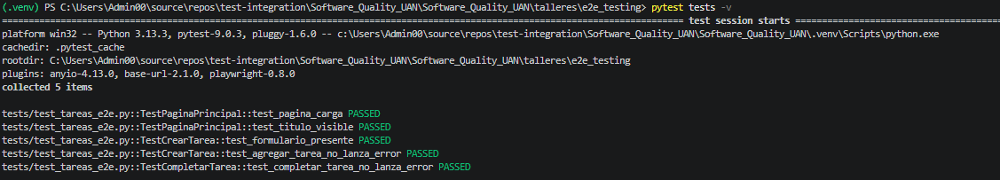
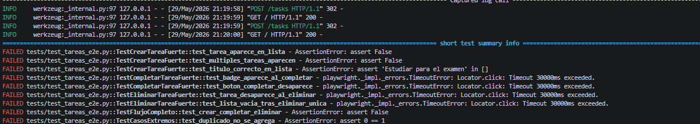

# Informe — Taller de Pruebas E2E

---

## Análisis de las pruebas iniciales

### ¿Las pruebas iniciales verifican algo útil?

La verdad es que no. Después de revisar el código de los tests, me di cuenta de que las pruebas que venían al inicio del taller básicamente no comprueban nada importante. Por ejemplo, hay una prueba que solo verifica que la URL de la página no sea nula, lo cual siempre va a ser verdad sin importar si la página funciona bien o está completamente rota. Otra prueba usa una condición del tipo "mayor o igual a cero" para verificar que un elemento existe, pero esa condición siempre es verdadera, así el elemento no esté en la página.

En resumen, los tests pasaban porque estaban mal escritos, no porque el sistema funcionara correctamente.

### ¿Qué interacciones del usuario no estaban cubiertas?

Había varias cosas que un usuario real haría y que los tests ignoraban por completo:

- Crear una tarea y verificar que efectivamente aparezca en la lista con el título correcto.
- Marcar una tarea como completada y verificar que aparezca el badge "✓ Completada" y que el título quede tachado.
- Eliminar una tarea y verificar que desaparezca de la lista.
- Intentar crear una tarea sin escribir ningún título.
- Verificar qué pasa cuando la lista está vacía (el mensaje "No hay tareas").

Ninguna de estas acciones estaba siendo validada. Los tests solo verificaban que el formulario existía y que hacer clic en un botón no generaba un error de red, pero nunca revisaban el resultado visible para el usuario.

---

## El sabotaje

### ¿Los tests iniciales detectaron la modificación?

No. Cuando modifiqué la función `create_task` en `app.py` para que no guardara las tareas (es decir, quité la línea que llama a `repo.add()`), todos los tests siguieron pasando como si nada hubiera pasado. El sistema estaba roto, las tareas no se guardaban, pero los tests decían que todo estaba bien.

A continuación los resultados de ejecutar `pytest tests/ -v` con los **tests débiles** y el sabotaje activo — todos pasan aunque la app está rota:

### ¿Qué debilidad fundamental expone este experimento?

Lo que queda claro con este experimento es que una prueba que no verifica el estado final de la interfaz no sirve de mucho. Si el test solo comprueba que no hubo un error al hacer clic, pero nunca revisa si la tarea realmente apareció en la pantalla, entonces ese test no está protegiendo nada. Puede darte una falsa sensación de seguridad: el sistema falla, pero los tests dicen que todo está bien.

La debilidad fundamental es que los tests medían la ausencia de errores en lugar de verificar el comportamiento real del sistema. Una buena prueba E2E debe actuar como un usuario real: hacer una acción y luego comprobar que el resultado visible en la pantalla es el esperado.

### Comprobación con los tests mejorados

Para confirmar que los tests fuertes sí funcionan, repetí el mismo sabotaje pero esta vez corriendo la suite mejorada. El resultado fue completamente diferente:

**9 de 11 tests fallaron**, detectando correctamente que las tareas no se estaban guardando. Los únicos 2 que pasaron fueron los que verifican que la lista esté vacía — lo cual era esperado, porque con el sabotaje activo la lista siempre está vacía.

Esto demuestra que los tests fuertes cumplen su propósito: detectar errores reales en el sistema.

---

## Reflexión sobre pruebas E2E en CI/CD

### ¿Qué es un flaky test y por qué son comunes en E2E?

Un flaky test es una prueba que a veces pasa y a veces falla, sin que el código haya cambiado. Es como lanzar una moneda: no puedes confiar en el resultado.

En pruebas E2E esto es especialmente común porque el test depende de muchas cosas al mismo tiempo: el navegador, el servidor, la red, y los tiempos de carga de la página. Por ejemplo, si una prueba hace clic en un botón antes de que la página haya terminado de cargar, puede fallar aunque el sistema esté funcionando perfectamente. Esa misma prueba puede pasar sin problemas si el computador va más rápido ese día.

Un ejemplo concreto: si después de crear una tarea el test busca inmediatamente el elemento en la lista sin esperar a que la página se recargue, algunos días lo encontrará y otros días no. Eso es un flaky test.

### ¿Cómo garantizarías el aislamiento entre tests E2E?

El aislamiento significa que cada test debe empezar desde cero, sin depender de lo que hicieron los tests anteriores. Si un test crea una tarea y el siguiente test asume que esa tarea ya no existe, puedes tener problemas difíciles de rastrear.

En este taller, el `conftest.py` ya maneja esto automáticamente: antes de cada test hace una petición a `/tasks/clear` para limpiar todas las tareas. Así cada test arranca con la lista vacía, sin importar lo que haya pasado antes. Esta es la forma correcta de hacerlo: usar un endpoint o una función que limpie el estado antes de cada prueba.

### ¿Cuándo usarías una prueba de integración en lugar de una E2E?

Las pruebas E2E son útiles para verificar flujos completos desde el punto de vista del usuario, pero son lentas y más frágiles. Preferiría una prueba de integración cuando quiero verificar que dos partes del sistema funcionan bien juntas (por ejemplo, que la API guarda bien los datos en la base de datos), sin necesidad de abrir un navegador. Las pruebas de integración son más rápidas, más estables y más fáciles de mantener.

En general, la regla es: si puedo verificar lo que necesito sin un navegador, uso integración. Solo uso E2E cuando necesito confirmar que la experiencia completa del usuario funciona de principio a fin.

### ¿Cómo aplicarías Playwright en un proyecto con microservicios?

En un proyecto con microservicios, cada servicio hace una parte del trabajo y todos se comunican entre sí. Playwright seguiría siendo útil para probar los flujos completos desde la interfaz de usuario, que es el punto donde todos los servicios convergen.

Lo que haría es levantar un entorno de pruebas donde todos los servicios estén corriendo (o usar versiones simuladas de los que no necesito probar), y luego escribir pruebas E2E que simulen lo que haría un usuario real: entrar a la app, hacer acciones, y verificar que los resultados sean los correctos. Así puedo detectar si un cambio en un microservicio rompió algo visible para el usuario, aunque internamente sean varios sistemas trabajando juntos.
